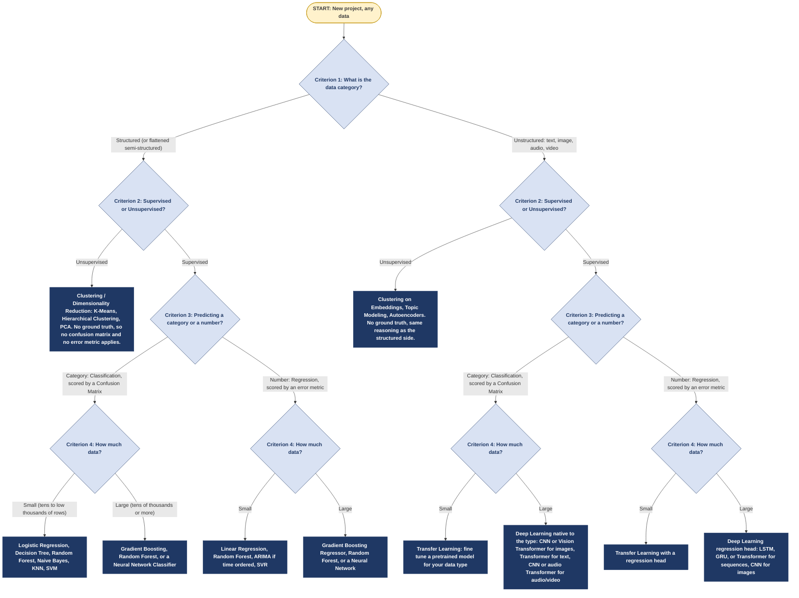

# Stock Price Prediction Project

## Model Selection Flowchart

```mermaid
%%{init: {'flowchart': {'curve': 'basis'}} }%%
flowchart TD
    Start(["START: New project, any data"]) --> Q1{"Criterion 1: What is the data category?"}

    Q1 -->|"Structured (or flattened semi-structured)"| Q2S{"Criterion 2: Supervised or Unsupervised?"}
    Q1 -->|"Unstructured: text, image, audio, video"| Q2U{"Criterion 2: Supervised or Unsupervised?"}

    Q2S -->|Unsupervised| UnsupS["Clustering / Dimensionality Reduction: K-Means, Hierarchical Clustering, PCA. No ground truth, so no confusion matrix and no error metric applies."]
    Q2U -->|Unsupervised| UnsupU["Clustering on Embeddings, Topic Modeling, Autoencoders. No ground truth, same reasoning as the structured side."]

    Q2S -->|Supervised| Q3S{"Criterion 3: Predicting a category or a number?"}
    Q2U -->|Supervised| Q3U{"Criterion 3: Predicting a category or a number?"}

    Q3S -->|"Category: Classification, scored by a Confusion Matrix"| Q4SC{"Criterion 4: How much data?"}
    Q3S -->|"Number: Regression, scored by an error metric"| Q4SR{"Criterion 4: How much data?"}
    Q3U -->|"Category: Classification, scored by a Confusion Matrix"| Q4UC{"Criterion 4: How much data?"}
    Q3U -->|"Number: Regression, scored by an error metric"| Q4UR{"Criterion 4: How much data?"}

    Q4SC -->|"Small (tens to low thousands of rows)"| LSCsmall["Logistic Regression, Decision Tree, Random Forest, Naive Bayes, KNN, SVM"]
    Q4SC -->|"Large (tens of thousands or more)"| LSClarge["Gradient Boosting, Random Forest, or a Neural Network Classifier"]

    Q4SR -->|Small| LSRsmall["Linear Regression, Random Forest, ARIMA if time ordered, SVR"]
    Q4SR -->|Large| LSRlarge["Gradient Boosting Regressor, Random Forest, or a Neural Network"]

    Q4UC -->|Small| LUCsmall["Transfer Learning: fine tune a pretrained model for your data type"]
    Q4UC -->|Large| LUClarge["Deep Learning native to the type: CNN or Vision Transformer for images, Transformer for text, CNN or audio Transformer for audio/video"]

    Q4UR -->|Small| LURsmall["Transfer Learning with a regression head"]
    Q4UR -->|Large| LURlarge["Deep Learning regression head: LSTM, GRU, or Transformer for sequences, CNN for images"]

    classDef decision fill:#D9E2F3,stroke:#1F3864,color:#1F3864,font-weight:bold
    classDef leaf fill:#1F3864,stroke:#1F3864,color:#ffffff,font-weight:bold
    classDef startNode fill:#FFF2CC,stroke:#BF8F00,color:#3B3B3B,font-weight:bold

    class Start startNode
    class Q1,Q2S,Q2U,Q3S,Q3U,Q4SC,Q4SR,Q4UC,Q4UR decision
    class UnsupS,UnsupU,LSCsmall,LSClarge,LSRsmall,LSRlarge,LUCsmall,LUClarge,LURsmall,LURlarge leaf
```
